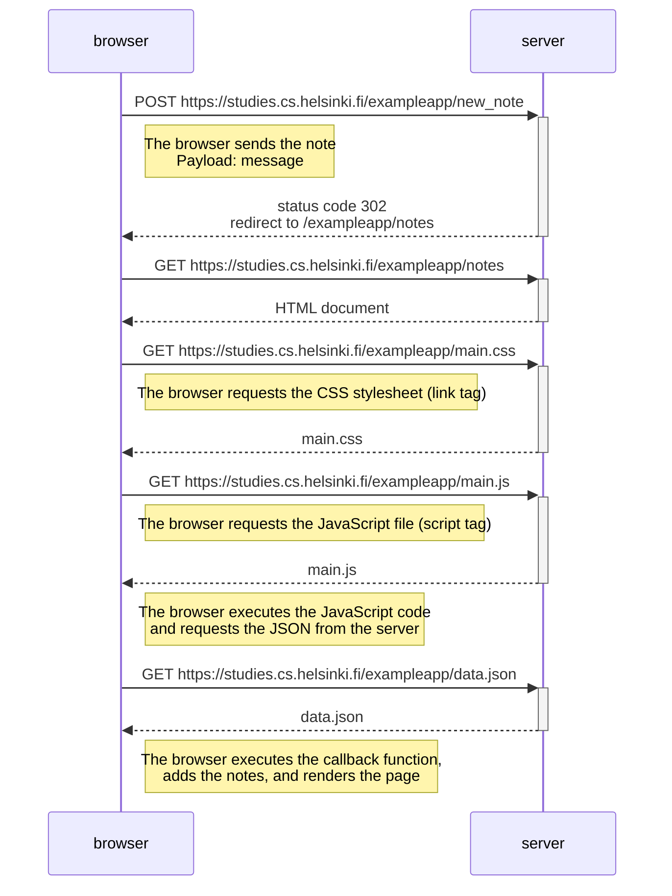

```mermaid
    sequenceDiagram
        participant browser
        participant server

        browser->>+server: POST https://studies.cs.helsinki.fi/exampleapp/new_note
        Note right of browser: The browser sends the note<br>Payload: message
        server-->>-browser: status code 302<br>redirect to /exampleapp/notes

        browser->>+server: GET https://studies.cs.helsinki.fi/exampleapp/notes
        server-->>-browser: HTML document

        browser->>+server: GET https://studies.cs.helsinki.fi/exampleapp/main.css
        Note right of browser: The browser requests the CSS stylesheet (link tag)
        server-->>-browser: main.css

        browser->>+server: GET https://studies.cs.helsinki.fi/exampleapp/main.js
        Note right of browser: The browser requests the JavaScript file (script tag)
        server-->>-browser: main.js
        Note right of browser: The browser executes the JavaScript code<br>and requests the JSON from the server

        browser->>+server: GET https://studies.cs.helsinki.fi/exampleapp/data.json
        server-->>-browser: data.json
        Note right of browser: The browser executes the callback function,<br>adds the notes, and renders the page
```
