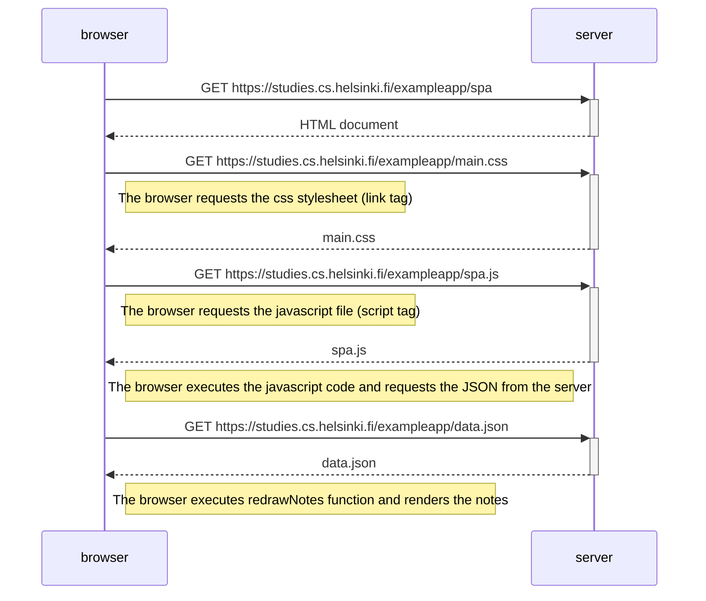

```mermaid
    sequenceDiagram
        participant browser
        participant server

        browser->>+server: GET https://studies.cs.helsinki.fi/exampleapp/spa
        server-->>-browser: HTML document

        browser->>+server: GET https://studies.cs.helsinki.fi/exampleapp/main.css
        Note right of browser: The browser requests the css stylesheet (link tag)
        server-->>-browser: main.css

        browser->>+server: GET https://studies.cs.helsinki.fi/exampleapp/spa.js
        Note right of browser: The browser requests the javascript file (script tag)
        server-->>-browser: spa.js
        Note right of browser: The browser executes the javascript code and requests the JSON from the server

        browser->>+server: GET https://studies.cs.helsinki.fi/exampleapp/data.json
        server-->>-browser: data.json
        Note right of browser: The browser executes redrawNotes function and renders the notes
```
